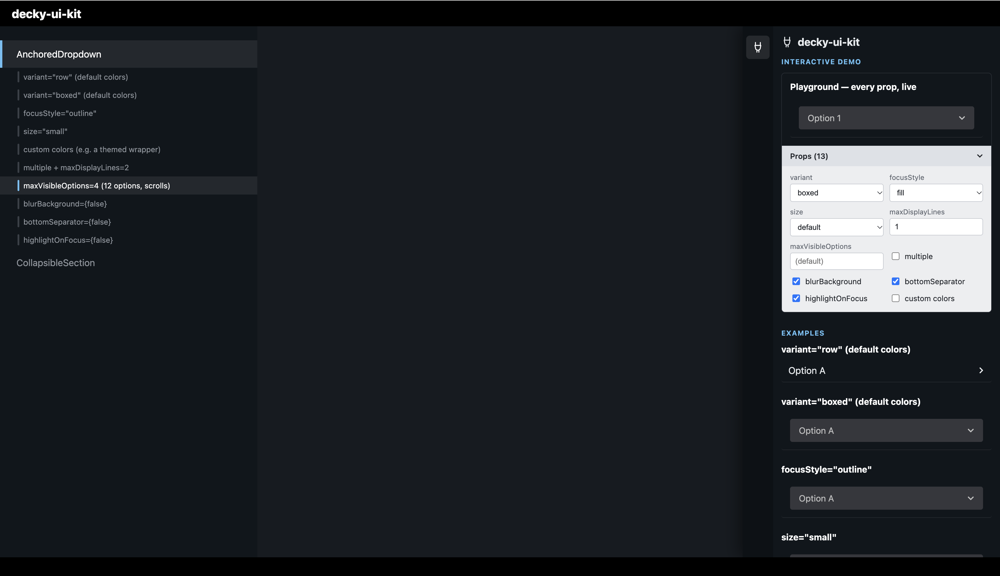

# decky-ui-kit

[](https://www.npmjs.com/package/@moi952/decky-ui-kit)
[](https://www.npmjs.com/package/@moi952/decky-ui-kit)

[](https://moi952.github.io/decky-ui-kit/)



Reusable UI components for [Decky Loader](https://github.com/SteamDeckHomebrew/decky-loader) plugins, built for cases where Steam's own native popup components (`DropdownItem`, `showContextMenu`, `Menu`) can't be used — opening any of them resets the whole plugin panel back to its home view once closed. Every component here is a hand-built inline overlay instead, with its own keyboard/mouse/gamepad focus handling.

## Install

```bash
npm install @moi952/decky-ui-kit
```

Or pin an exact version: `npm install @moi952/decky-ui-kit@0.1.0`.

Installing straight from GitHub also works (`npm install github:moi952/decky-ui-kit#v0.1.0`) — `dist/` is committed on every release, so it needs no install-time build step either way.

## Demo

Every prop combination side by side, with a live Playground panel per component. It's a plain-browser visual reference, not the real Steam client: `Field`/`DialogButton`/`Focusable` are mocked, so corner-radius inheritance, the native focus halo, and gamepad input aren't reproduced there.

Run it locally with `npm run demo:dev`.

## Components

### `AnchoredDropdown`

A dropdown whose option list renders inline, anchored to its own trigger — not through a native Steam popup.

```tsx
import { AnchoredDropdown } from "@moi952/decky-ui-kit";

<AnchoredDropdown
  variant="boxed"
  focusStyle="fill"
  options={[
    { value: "a", label: "Option A" },
    { value: "b", label: "Option B" },
  ]}
  selectedValue={value}
  onChange={setValue}
/>
```

<details>
<summary>Props</summary>

| Prop | Type | Default | Description |
| --- | --- | --- | --- |
| `options` | `{ value: string; label: string }[]` | — | The list of choices. |
| `selectedValue` | `string` | — | Current value. In `multiple` mode, a comma-joined list of values. |
| `onChange` | `(value: string) => void` | — | Called with the new value (or comma-joined list, in `multiple` mode). |
| `variant` | `"row" \| "boxed"` | `"boxed"` | `"row"`: flat, matches surrounding list rows. `"boxed"`: bordered box with an arrow. |
| `focusStyle` | `"fill" \| "outline"` | `"fill"` | `"fill"`: solid white background on focus. `"outline"`: transparent border that fills on focus. |
| `size` | `"default" \| "small"` | `"default"` | Row/trigger height and font size. |
| `bgColor` | `string` | Steam-like dark gray | Background color. |
| `textColor` | `string` | Steam-like light gray | Text color. |
| `borderColor` | `string` | `"transparent"` | Trigger and list border color. |
| `blurBackground` | `boolean` | `true` | Blurs the panel behind the list while it's open. |
| `multiple` | `boolean` | `false` | Multi-select mode (comma-joined value). |
| `selectedValuesLayout` | `"inline" \| "stacked"` | `"inline"` | Multi-select summary as one comma-joined line, or one value per line. |
| `selectedCountLabel` | `(count: number) => ReactNode` | — | Multi-select only: small caption above the trigger once ≥1 option is picked (e.g. `n => \`${n} selected\``). No i18n of its own — the caller formats the text. |
| `onSecondaryButton` | `() => void` | — | Fires on gamepad X / Steam "Secondary" while the trigger or open list has focus. |
| `onSecondaryActionDescription` | `ReactNode` | — | Shown in Steam's own bottom action-legend bar next to the X prompt (only while `onSecondaryButton` is set). Same names/shape as `@decky/ui`'s own `FooterLegendProps`. |
| `onOptionsButton` | `() => void` | — | Fires on gamepad Y / Steam "Options" while the trigger or open list has focus. |
| `onOptionsActionDescription` | `ReactNode` | — | Shown in Steam's own bottom action-legend bar next to the Y prompt (only while `onOptionsButton` is set). |
| `maxDisplayLines` | `number` | `1` | Lines the trigger's selected-value summary can wrap before clipping. `0` shows it in full, unclamped. |
| `maxVisibleOptions` | `number` | — | Rows visible before the list scrolls. `0` shows every option, no cap. Defaults to a fixed max height. |
| `highlightOnFocus` | `boolean` | `true` | Native Steam focus highlight band, themeable via CSS Loader. |
| `bottomSeparator` | `boolean` | `true` | Native Steam separator line below the trigger. |

</details>

The list's corner radius is read at runtime from the trigger's own computed `border-radius`, so it automatically matches Steam's native rounding — including any CSS Loader "round" theme — without hardcoding a variable name.

### `CollapsibleSection`

An expand/collapse row built on `Field`, for tucking secondary content (settings, history, details) behind a single toggleable header.

```tsx
import { CollapsibleSection } from "@moi952/decky-ui-kit";

<CollapsibleSection label="Advanced settings" expanded={expanded} onToggle={() => setExpanded(!expanded)}>
  <MySettingsFields />
</CollapsibleSection>
```

<details>
<summary>Props</summary>

| Prop | Type | Default | Description |
| --- | --- | --- | --- |
| `label` | `string` | — | Header text. |
| `expanded` | `boolean` | — | Whether the children are shown. State is owned by the caller. |
| `onToggle` | `() => void` | — | Called on click/activate; flip `expanded` in response. |
| `children` | `ReactNode` | — | Rendered below the header while `expanded` is `true`. |

</details>

### `FieldTextInput`

A text input with the standard Field row look (bottom separator, focus highlight, size) — `@decky/ui`'s own `TextField` doesn't extend the same row contract `ToggleField`/`SliderField` do, so it renders bare by default.

```tsx
import { FieldTextInput } from "@moi952/decky-ui-kit";

<FieldTextInput label="Frame Rate Limit" mustBeNumeric value={value} onChange={setValue} />
```

<details>
<summary>Props</summary>

| Prop | Type | Default | Description |
| --- | --- | --- | --- |
| `value` | `string` | — | Current value. |
| `onChange` | `(value: string) => void` | — | Called with the new value on every keystroke. |
| `label` | `ReactNode` | — | Label text/content. |
| `size` | `"default" \| "small"` | `"default"` | Input font size and padding. |
| `labelPosition` | `"top" \| "left" \| "right"` | `"top"` | Where the label sits relative to the input. |
| `mustBeNumeric` | `boolean` | `false` | Restricts input to numeric characters. |
| `bottomSeparator` | `boolean` | `true` | Native Steam separator line below the row. |
| `highlightOnFocus` | `boolean` | `true` | Background highlight while the input has focus. |
| `placeholder` | `string` | — | Shown when empty (TextField has no native placeholder, this is a positioned overlay). |
| `iconStart` | `ReactNode` | — | Icon at the start of the input. |
| `iconEnd` | `ReactNode` | — | Icon at the end of the input. |

</details>

### `InfoTable`

A bordered, rounded key/value table for a single entity's details — icon, short label, value right-aligned. Built for a detail screen (an app, a package, a save file, ...) sitting below its header: version, source, file path, and so on, one row each. A row's `accent` color (e.g. green for an available update) tints both its icon and its value.

```tsx
import { InfoTable } from "@moi952/decky-ui-kit";
import { FiTag, FiUpload, FiFile } from "react-icons/fi";

<InfoTable
  rows={[
    { icon: <FiTag size={13} />, label: "Version", value: "1.4.2" },
    {
      icon: <FiUpload size={13} />,
      label: "Available",
      value: "1.5.0",
      accent: "#4caf50",
    },
    { icon: <FiFile size={13} />, label: "Path", value: "/home/deck/App.AppImage" },
  ]}
/>
```

<details>
<summary>Props</summary>

| Prop | Type | Default | Description |
| --- | --- | --- | --- |
| `rows` | `InfoTableRow[]` | — | The rows to render, top to bottom. |
| `labelWidth` | `number` | `90` | Label column width — every row's value starts at this same x position. |
| `labelColor` | `string` | Steam-like light gray | Label text color. |
| `iconColor` | `string` | Steam-like dark gray | A row's icon color, when it has no `accent`. |
| `valueColor` | `string` | `"#fff"` | A row's value color, when it has no `accent`. |
| `bgColor` | `string` | Steam-like dark, translucent | Table background. |
| `borderColor` | `string` | Steam-like dark, translucent | Table border. |

`InfoTableRow`:

| Field | Type | Description |
| --- | --- | --- |
| `icon` | `ReactNode` | — |
| `label` | `ReactNode` | Short label on the left (fixed width, so values stay aligned across rows). |
| `value` | `ReactNode` | Right-aligned; wraps on overflow rather than clipping. |
| `accent` | `string` | Tints this row's icon and value (default: neutral gray icon, white value). |

</details>

### `InlineConfirm`

A destructive-action confirmation shown inline, right below whatever triggered it — not a modal. A description line plus an equal-width Cancel/Confirm button pair. No i18n of its own — pass your own translated labels.

```tsx
import { InlineConfirm } from "@moi952/decky-ui-kit";

{confirming && (
  <InlineConfirm
    description="Remove the wrapper from this game?"
    confirmLabel="Remove"
    onCancel={() => setConfirming(false)}
    onConfirm={() => { removeWrapper(); setConfirming(false); }}
  />
)}
```

<details>
<summary>Props</summary>

| Prop | Type | Default | Description |
| --- | --- | --- | --- |
| `description` | `ReactNode` | — | The confirmation message. |
| `onCancel` | `() => void` | — | Called when Cancel is picked. |
| `onConfirm` | `() => void` | — | Called when the confirm button is picked. |
| `cancelLabel` | `ReactNode` | `"Cancel"` | Cancel button text. |
| `confirmLabel` | `ReactNode` | `"Delete"` | Confirm button text. |
| `size` | `"small" \| "medium" \| "large"` | `"small"` | Button padding/font size. |
| `variant` | `"danger" \| "primary"` | `"danger"` | Red confirm button for a destructive action, or blue for a plain confirm. |

</details>

### `MediaRow`

A focusable media+title(+details)(+actions) row. The same shape covers both "a list of apps, each with a status stack and inline Update/Exclude buttons" and "a grid of game capsules, each just a cover and a title" — which of the two a given instance looks like follows entirely from which props are passed: give it `actions` and it splits into a header + a separate collapsible action row; leave `actions` out and the whole thing is one single-press card. `mediaLayout="stretch"` swaps the centered-icon box for a fixed-height, auto-width cover-image box instead of the icon's centered square — the media sizes itself from its own aspect ratio, so it's never cropped.

```tsx
import { MediaRow } from "@moi952/decky-ui-kit";
import { FiEyeOff } from "react-icons/fi";

// A status-stack app row, with an inline action row
<MediaRow
  media={}
  title="Firefox"
  details={
    <div style={{ fontSize: 11, color: "#9aa1a8" }}>128.0</div>
  }
  onPress={() => openDetails()}
  actions={
    <ActionButton onClick={exclude}><FiEyeOff size={12} /></ActionButton>
  }
  color="transparent"
  bottomSeparator
/>

// A cover-image capsule, no actions row at all
<MediaRow
  mediaLayout="stretch"
  mediaHeight={37}
  media={}
  title="Half-Life 2"
  titleLines={2}
  onPress={() => launch()}
  spacing={4}
  color="light"
/>
```

<details>
<summary>Props</summary>

| Prop | Type | Default | Description |
| --- | --- | --- | --- |
| `media` | `ReactNode` | — | The leading visual — an ``, a placeholder, badges overlaid on it. This component only sizes/positions the box around it. |
| `mediaWidth` | `number` | `32` | Media box width — only used by `mediaLayout="fixed"`. |
| `mediaHeight` | `number` | `32` | Media box height. |
| `mediaLayout` | `"fixed" \| "stretch"` | `"fixed"` | `"fixed"`: media centered in an exact `mediaWidth`×`mediaHeight` box (a small icon). `"stretch"`: exactly `mediaHeight` tall, but no fixed width at all — the media renders at whatever width its own aspect ratio calls for at that height (e.g. ``), so a cover image always shows in full. |
| `title` | `ReactNode` | — | The row's title. |
| `titleLines` | `number` | `1` | `1`: ellipsis-truncated single line. `>1`: line-clamped over that many lines. |
| `details` | `ReactNode` | — | Extra content under the title — your own pre-colored status line(s). Omit for a title-only row. |
| `onPress` | `() => void` | — | Called when the header is pressed. |
| `actions` | `ReactNode` | — | Rendered in its own row below the header, inside a `Focusable`. Omit entirely for a single-button card with no action row. Given without `onPress`, pressing the header toggles this row instead of navigating. |
| `collapsedByDefault` | `boolean` | `false` | Only relevant when `actions` is given and `onPress` isn't — starts with the actions row hidden until the header is pressed once. |
| `color` | `"light" \| "dark" \| "transparent" \| "success" \| "danger" \| "info" \| "warning"` | — (required) | The row's own look — border + matching background. There's no "no color" state, so a row's border width never shifts depending on which color a sibling happens to have. `"light"`/`"dark"` are the two plain card backgrounds with no state implied; `"transparent"` is for a flush row inside a `bottomSeparator` list, which must show no card look of its own; the rest are accent colors for flagging a real state (e.g. `"success"` for "currently active"). |
| `accentBorderColor` | `string` | — | Overrides `color`'s border color. |
| `accentBorderWidth` | `number` | `2` | Border width — the same value applies to every color, so a row's size never shifts between states. |
| `accentBackground` | `string` | — | Overrides `color`'s background color. |
| `borderOnFocus` | `boolean` | `true` | A real border on focus/hover, via an inset box-shadow (not `outline` — outline doesn't respect border-radius). Independent of `highlightOnFocus` below — same convention as `ScreenshotCarousel`'s own `borderOnFocus`. |
| `highlightColor` | `string` | `"#dcdedf"` | Border color on focus/hover (used when `borderOnFocus`). Same default across every focusable component in this library. |
| `highlightOnFocus` | `boolean` | `true` | A background tint on focus/hover, independent of `borderOnFocus` above. |
| `highlightBackground` | `string` | `"#2a3a4a"` | Background color on focus/hover (used when `highlightOnFocus`). |
| `spacing` | `number` | `0` | Gap below the row, for a list of spaced-apart cards. An alternative to `bottomSeparator`, not meant combined with it. |
| `bottomSeparator` | `boolean` | `false` | A bottom divider line, for a continuous divided list — the alternative to `spacing`. Pair with `color="transparent"` so the row shows no card background of its own, just the divider and the focus highlight. |
| `onSecondaryButton` | `(evt) => void` | — | Fires on gamepad X / Steam "Secondary" while the row has focus. |
| `onSecondaryActionDescription` | `ReactNode` | — | Shown in Steam's own bottom action-legend bar next to the X prompt (only while `onSecondaryButton` is set). |

</details>

### `ScreenshotCarousel`

A single screenshot "stage" — app store/catalog "photos", one shown at a time, reading as one pressable card (same rounded corners, same `bottomSeparator`/focus-border conventions as `MediaRow`). Moved with DIR_LEFT/DIR_RIGHT or LB/RB (advertised in Steam's own bottom action-legend bar) — no on-screen prev/next buttons on this inline view, those only live in the full-screen zoom pressing the photo opens (a real Steam modal, via `showModal`/`ModalRoot`). Renders nothing at all when `screenshots` is empty, so a caller never needs its own length check around it.

```tsx
import { ScreenshotCarousel } from "@moi952/decky-ui-kit";

<ScreenshotCarousel screenshots={entry.screenshots} height={140} />
```

<details>
<summary>Props</summary>

| Prop | Type | Default | Description |
| --- | --- | --- | --- |
| `screenshots` | `string[]` | — | Image URLs (or data URIs). Renders nothing when empty. |
| `height` | `number` | `120` | Height of the inline (non-zoomed) view. |
| `bottomSeparator` | `boolean` | `false` | A bottom divider line, for sitting inside a continuous divided list — same convention as `MediaRow`'s own `bottomSeparator`. |
| `borderOnFocus` | `boolean` | `true` | A real border on focus/hover, via an inset box-shadow (not `outline`). Independent of `highlightOnFocus` below — same convention as `MediaRow`'s own `borderOnFocus`. |
| `highlightColor` | `string` | `"#dcdedf"` | Border color on focus/hover (used when `borderOnFocus`). Same default across every focusable component in this library. |
| `highlightOnFocus` | `boolean` | `true` | A background tint behind the stage on focus/hover (only visible where the photo doesn't already fill the box), independent of `borderOnFocus` above. |
| `highlightBackground` | `string` | `"#2a3a4a"` | Background color on focus/hover (used when `highlightOnFocus`). |
| `prevActionDescription` | `ReactNode` | `"Previous"` | Shown in Steam's own bottom action-legend bar next to the LB prompt (only while there's more than one screenshot). |
| `nextActionDescription` | `ReactNode` | `"Next"` | Shown next to the RB prompt. |

</details>
